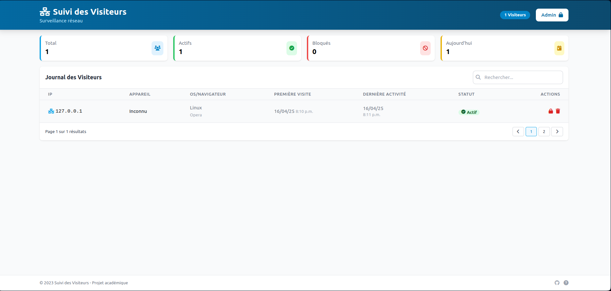

# README - Windows Firewall Tester with Django / Testeur de Pare-feu Windows avec Django

## 🌐 Table of Contents Project Context

* Preview

* Project context

* Key Objectives

* Project Showcase

* Hosting on IIS Academic Use Notice

* Licence

## 👀 Preview

Here is a preview as image of the current interface.



## 📝 Project Context

### English:

This academic project demonstrates Windows Firewall rule management through a Django web interface hosted on IIS (
Windows Server 2022). It provides practical testing of firewall behaviors when blocking/unblocking client connections.

### Français:

Ce projet académique démontre la gestion des règles du Pare-feu Windows via une interface web Django hébergée sur IIS (
Windows Server 2022). Il permet de tester concrètement les comportements du pare-feu lors du blocage/déblocage de
connexions clients.

## 🎯 Key Objectives / Objectifs Principaux

✅ Test firewall rule creation/deletion netsh advfirewall firewall add/delete rule

✅ Validate remote IP blocking effectiveness

✅ Monitor connection attempts in real-time

✅ Demonstrate IIS-Django-Firewall integration

## 🚀 Project Showcase

- 🔥 Live firewall rule updates
- 📊 Connection analytics dashboard
- ⚡ Automated test scenarios

## 🚀 Hosting on IIS

0. Prerequisites

- Windows Server 2022
- IIS with CGI enabled
- Python 3.10+


1. Enable Required Windows Features in powershell as admin

```bash
Install-WindowsFeature Web-Server, Web-CGI, Web-Common-Http
```

2. Clone repository && Install dependencies

```bash
# 
git clone git@github.com:WesleyEliel/Django-Win-IIS-Firewall-Simulator.git
cd Django-Win-IIS-Firewall-Simulator

# Install dependencies
pip install -r requirements.txt
```

3. Configure wfastcgi Handler

```bash
wfastcgi-enable (Note the Python and wfastcgi paths shown in output)
```

5. Create Application Pool Open IIS Manager

- Open IIS Manager
- Create new Application Pool:
    - .NET CLR version: "No Managed Code"
    - Identity: "ApplicationPoolIdentity"

4. Configure Website

- Create a web.config file with this config

```
<!-- web.config -->
<?xml version="1.0" encoding="UTF-8"?>
<configuration>
  <system.webServer>
    <handlers>
      <add name="PythonHandler" 
           path="*" 
           verb="*" 
           modules="FastCgiModule"
           scriptProcessor="C:\Python39\python.exe|C:\Python39\Lib\site-packages\wfastcgi.py"
           resourceType="Unspecified"/>
    </handlers>
  </system.webServer>
  
  <appSettings>
    <add key="WSGI_HANDLER" value="django.core.wsgi.get_wsgi_application()"/>
    <add key="PYTHONPATH" value="C:\firewall-manager"/>
    <add key="DJANGO_SETTINGS_MODULE" value="firewall_manager.settings"/>
  </appSettings>
</configuration>
```

5. Set Permissions

```powershell
icacls "C:\firewall-manager" /grant "IIS_IUSRS:(OI)(CI)(RX)"
```

6. Configure Static Files

```bash
python manage.py collectstatic
```

7. Restart IIS powershell

```bash
iisreset
````

## 📜 Academic Use Notice

This project is intended solely for educational purposes in network security classes. All firewall modifications should
be approved by your system administrator before implementation.

Ce projet est destiné uniquement à des fins pédagogiques dans les cours de sécurité réseau. Toute modification du
pare-feu doit être approuvée par votre administrateur système avant mise en œuvre.

***

## Licence